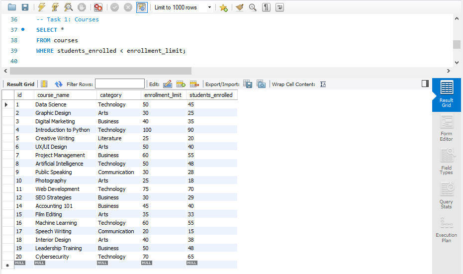
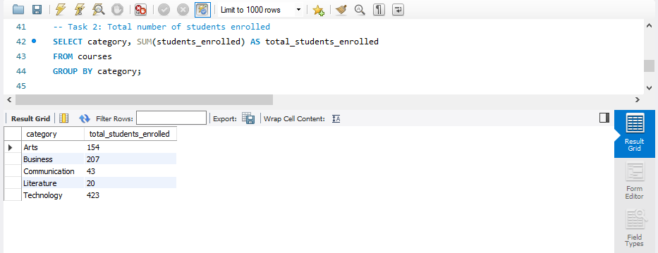
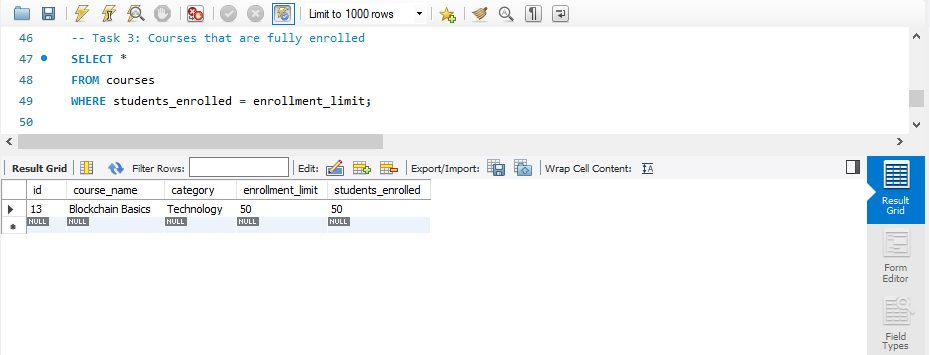
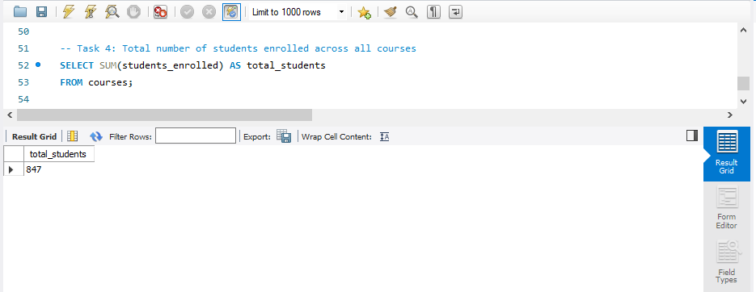
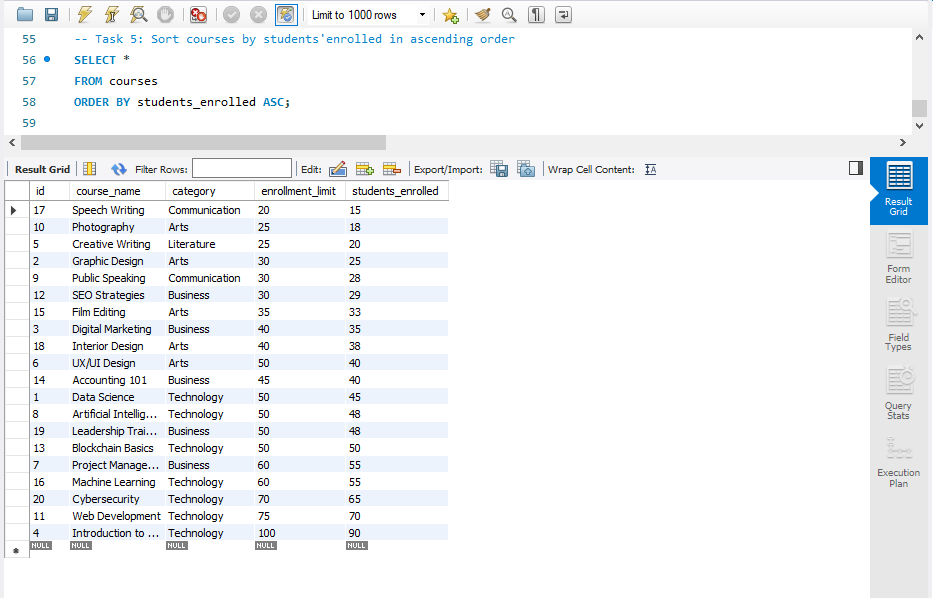
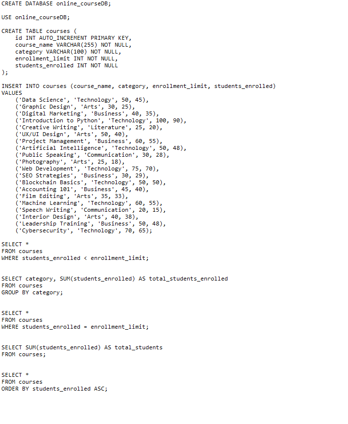

# Final Lab Task 3.1: Using SELECT CLAUSE
For this task, we are given initial query then perform the SELECT statements required for each problems. To use a SELECT clause in order to specify the names of the fields that have data that want to use in a query. 

## Here’s the Query Statements

Fisrt, a command that create a database, so subsequent SQL operations will be performed within that specific database.
```sql
CREATE DATABASE online_courseDB;
USE online_courseDB;
```

### TASK 1
```sql
SELECT * 
FROM courses 
WHERE students_enrolled < enrollment_limit;
```
### TASK 2
```sql
SELECT category, SUM(students_enrolled) AS total_students_enrolled
FROM courses
GROUP BY category;
```

### TASK 3
```sql
SELECT * 
FROM courses 
WHERE students_enrolled = enrollment_limit;
```

### TASK 4
```sql
SELECT SUM(students_enrolled) AS total_students
FROM courses;
```

### TASK 5
```sql
SELECT * 
FROM courses 
ORDER BY students_enrolled ASC;
```

## Here's the screenshot of the whole Query Statements and Table Structure (See screenshots)

### TASK 1



### TASK 2



### TASK 3



### TASK 4



### TASK 5



### Sql copy of the database and table structures




