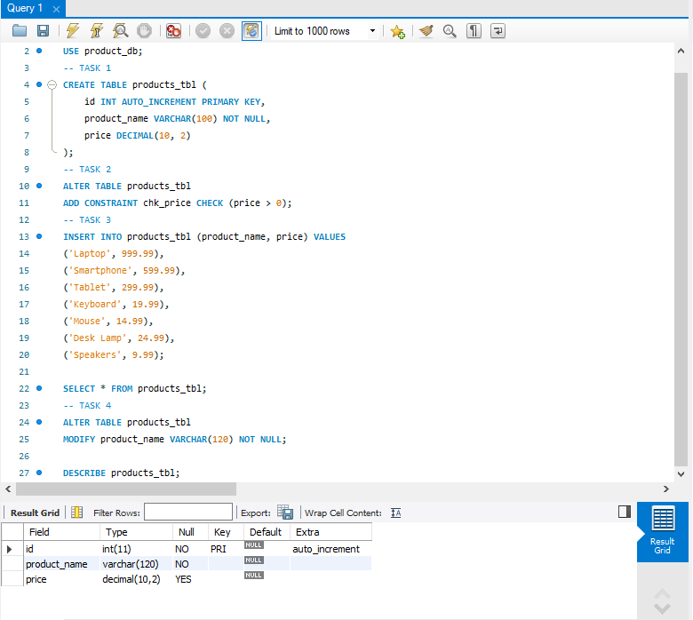
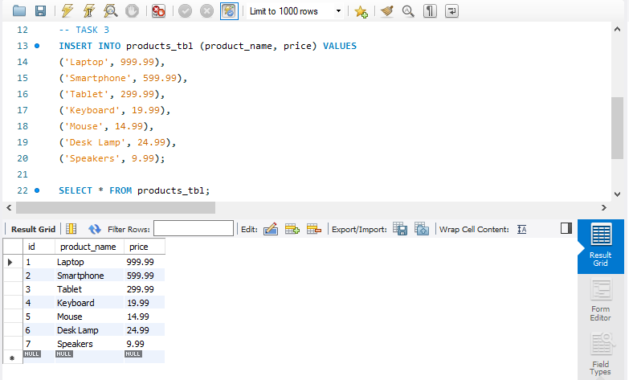
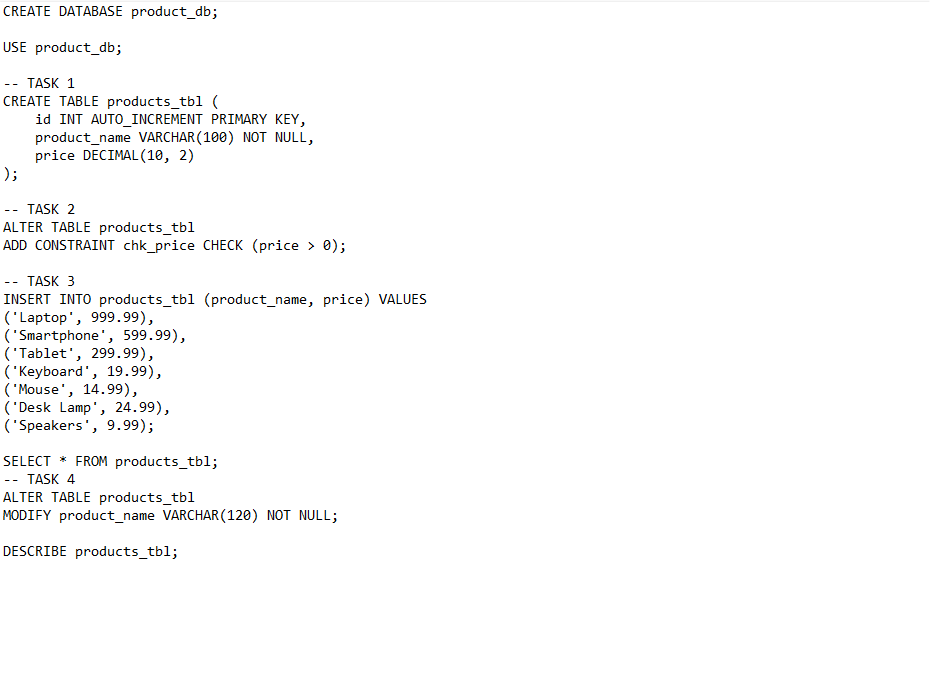

# Final Lab Task 3: Table Manipulation
This task involves creating and managing a product database using MySQL. It is required to follow a step-by-step approach to perform operations such as table creation, data insertion, and schema modification.

## Here’s the Query Statements

Fisrt, a command that create a database, so subsequent SQL operations will be performed within that specific database.
```sql
CREATE DATABASE product_db;

USE product_db;
```

### TASK 1
```sql
CREATE TABLE products_tbl (
    id INT AUTO_INCREMENT PRIMARY KEY,
    product_name VARCHAR(100) NOT NULL,
    price DECIMAL(10, 2)
);
```
### TASK 2
```sql
ALTER TABLE products_tbl
ADD CONSTRAINT chk_price CHECK (price > 0);
```

### TASK 3
```sql
INSERT INTO products_tbl (product_name, price) VALUES
('Laptop', 999.99),
('Smartphone', 599.99),
('Tablet', 299.99),
('Keyboard', 19.99),
('Mouse', 14.99),
('Desk Lamp', 24.99),
('Speakers', 9.99);

SELECT * FROM products_tbl;
```

### TASK 4
```sql
ALTER TABLE products_tbl
MODIFY product_name VARCHAR(120) NOT NULL;
```
This command is used in MySQL Workbench to display the structure of the table, showing details about each column such as its name, data type, whether it allows NULL values, if it's a key, its default value, and any extra attributes.
```sql
DESCRIBE products_tbl;
```

 ### Product Table
 Here's the screenshot of the whole Query Statements and Table Structure (See screenshots)
 


###  Product's Value Table
 Here's the screenshot of Query Statements and Table Structure (See screenshots)
 


###  ER Diagram or Relational Schema 


### Sql copy of the database and table structures


