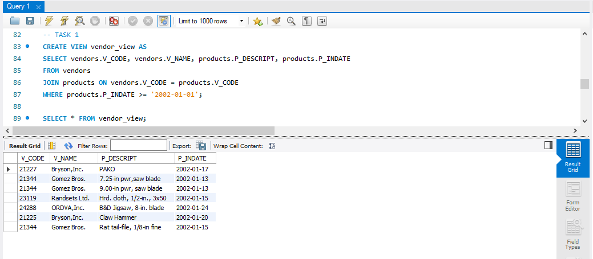
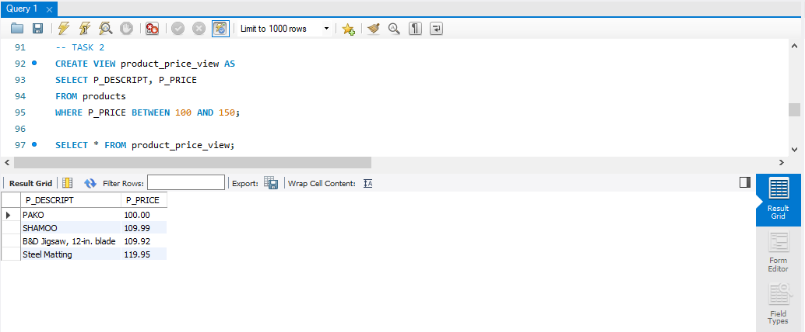
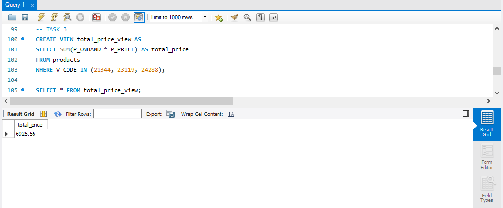
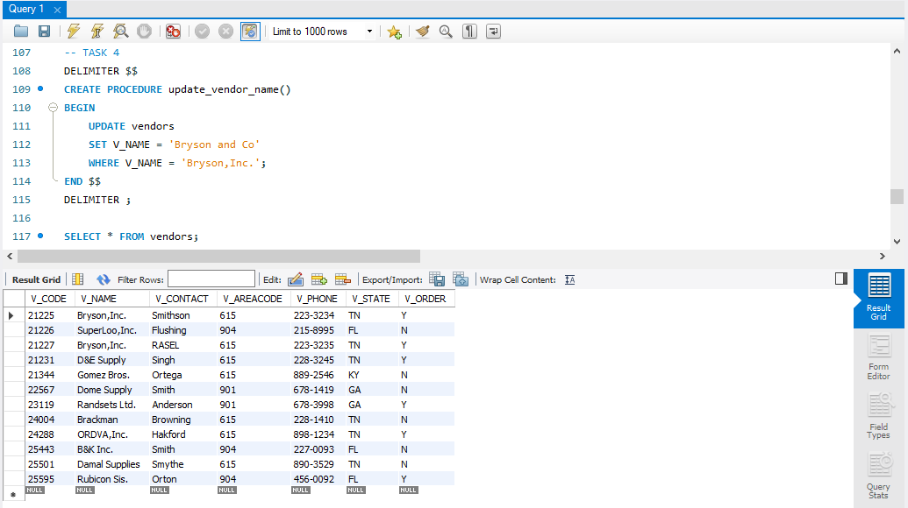
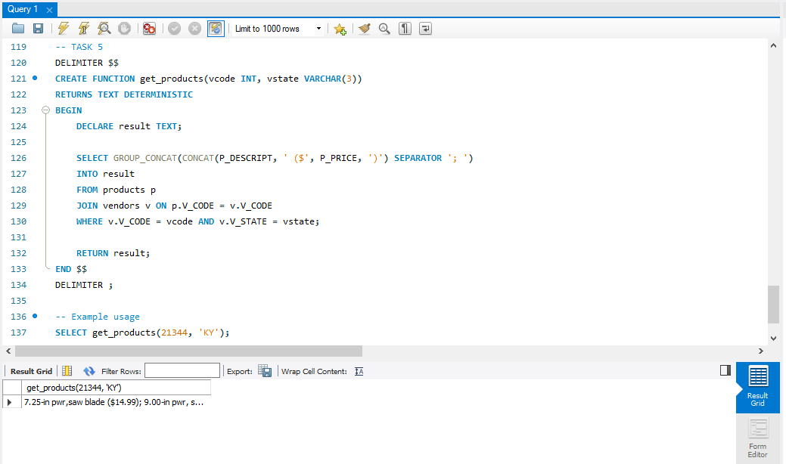
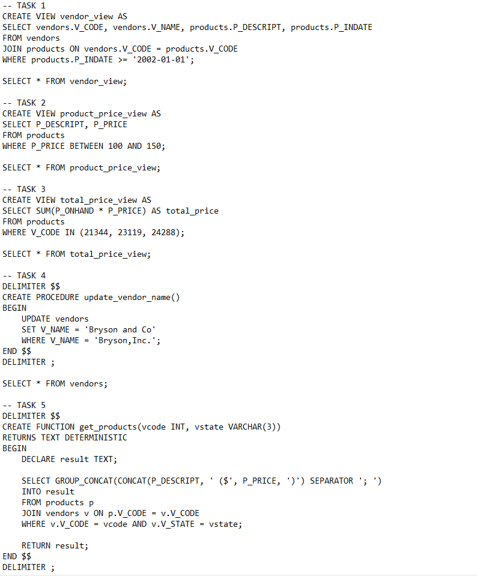

# Final Lab Task 3.1: Using SELECT CLAUSE
For this task, we are given initial query then perform the SELECT statements required for each problems. To use a SELECT clause in order to specify the names of the fields that have data that want to use in a query. 

## Here’s the Query Statements

### TASK 1
```sql
CREATE VIEW vendor_view AS
SELECT vendors.V_CODE, vendors.V_NAME, products.P_DESCRIPT, products.P_INDATE
FROM vendors
JOIN products ON vendors.V_CODE = products.V_CODE
WHERE products.P_INDATE >= '2002-01-01';
```

### TASK 2
```sql
CREATE VIEW product_price_view AS
SELECT P_DESCRIPT, P_PRICE
FROM products
WHERE P_PRICE BETWEEN 100 AND 150;
```

### TASK 3
```sql
CREATE VIEW total_price_view AS
SELECT SUM(P_ONHAND * P_PRICE) AS total_price
FROM products
WHERE V_CODE IN (21344, 23119, 24288);
```

### TASK 4
```sql
DELIMITER $$
CREATE PROCEDURE update_vendor_name()
BEGIN
    UPDATE vendors
    SET V_NAME = 'Bryson and Co'
    WHERE V_NAME = 'Bryson,Inc.';
END $$
DELIMITER ;
```

### TASK 5
```sql
DELIMITER $$
CREATE FUNCTION get_products(vcode INT, vstate VARCHAR(3))
RETURNS TEXT DETERMINISTIC
BEGIN
    DECLARE result TEXT;

    SELECT GROUP_CONCAT(CONCAT(P_DESCRIPT, ' ($', P_PRICE, ')') SEPARATOR '; ')
    INTO result
    FROM products p
    JOIN vendors v ON p.V_CODE = v.V_CODE
    WHERE v.V_CODE = vcode AND v.V_STATE = vstate;

    RETURN result;
END $$
DELIMITER ;
```

### It is how to run the function after creating it.
```sql
SELECT get_products(21344, 'KY');
```

## Here's the screenshot of the whole Query Statements and Table Structure (See screenshots)

### TASK 1



### TASK 2



### TASK 3



### TASK 4



### TASK 5



### Sql copy of the database and table structures




